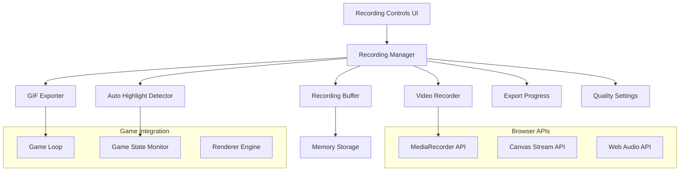

# Video Recording & GIF Export Design

## Overview

The video recording and GIF export system provides comprehensive gameplay capture capabilities for LightBikes. The design leverages browser-native APIs for efficient recording while maintaining game performance. The system includes real-time video recording, automatic highlight detection, instant replay functionality, and optimized GIF generation.

The architecture follows a modular approach with separate components for recording management, media processing, and user interface controls, ensuring clean separation of concerns and easy maintenance.

## Architecture

### High-Level Architecture



### Component Interaction Flow

1. **Recording Initiation**: User triggers recording via UI controls
2. **Stream Capture**: Canvas and audio streams are captured from the game
3. **Media Recording**: MediaRecorder API processes the streams
4. **Buffer Management**: Continuous buffer maintains recent gameplay for instant replay
5. **Highlight Detection**: Game events trigger automatic GIF creation
6. **Export Processing**: Background processing handles encoding and file generation

## Components and Interfaces

### Recording Manager

**Purpose**: Central coordinator for all recording operations

```javascript
class RecordingManager {
    constructor(gameInstance, rendererInstance) {
        this.game = gameInstance;
        this.renderer = rendererInstance;
        this.videoRecorder = new VideoRecorder();
        this.gifExporter = new GIFExporter();
        this.recordingBuffer = new RecordingBuffer();
        this.autoHighlight = new AutoHighlightDetector();
        this.qualitySettings = new QualitySettings();
    }
    
    // Core recording operations
    startRecording(options = {})
    stopRecording()
    pauseRecording()
    resumeRecording()
    
    // Instant replay functionality
    captureInstantReplay(duration = 30)
    
    // Export operations
    exportAsVideo(format = 'webm')
    exportAsGIF(options = {})
    
    // Event handling
    onGameEvent(eventType, eventData)
    onRecordingComplete(callback)
    onExportProgress(callback)
}
```

**Design Rationale**: Centralized management ensures consistent state handling and provides a single interface for all recording operations.

### Video Recorder

**Purpose**: Handles real-time video capture using MediaRecorder API

```javascript
class VideoRecorder {
    constructor() {
        this.mediaRecorder = null;
        this.recordedChunks = [];
        this.isRecording = false;
        this.stream = null;
    }
    
    // Stream management
    initializeStream(canvas, audioContext)
    startCapture(qualityOptions)
    stopCapture()
    
    // Recording control
    pause()
    resume()
    
    // Data handling
    getRecordedData()
    downloadRecording(filename)
    
    // Performance monitoring
    getRecordingStats()
}
```

**Key Features**:
- Uses MediaRecorder API for browser-native recording
- Supports multiple quality presets (720p30, 1080p30, 1080p60)
- Includes audio capture from game sounds
- Monitors performance impact during recording

### GIF Exporter

**Purpose**: Creates optimized animated GIFs from gameplay footage

```javascript
class GIFExporter {
    constructor() {
        this.gifWorker = null;
        this.isProcessing = false;
        this.compressionSettings = {
            quality: 10,
            workers: 2,
            workerScript: 'gif.worker.js'
        };
    }
    
    // GIF creation
    createGIFFromFrames(frames, options)
    createGIFFromVideo(videoBlob, startTime, duration)
    
    // Optimization
    optimizeForSocialMedia(gifBlob)
    compressGIF(gifBlob, targetSize)
    
    // Processing control
    cancelProcessing()
    getProcessingProgress()
}
```

**Design Rationale**: Uses web workers for GIF processing to prevent UI blocking. Implements compression algorithms to meet social media size requirements (under 10MB).

### Recording Buffer

**Purpose**: Maintains continuous buffer of recent gameplay for instant replay

```javascript
class RecordingBuffer {
    constructor(maxDuration = 30) {
        this.maxDuration = maxDuration;
        this.frameBuffer = [];
        this.audioBuffer = [];
        this.bufferSize = 0;
        this.isActive = false;
    }
    
    // Buffer management
    startBuffering()
    stopBuffering()
    addFrame(frameData, timestamp)
    addAudioChunk(audioData, timestamp)
    
    // Retrieval
    getLastSeconds(duration)
    getFrameRange(startTime, endTime)
    
    // Memory management
    clearBuffer()
    optimizeMemoryUsage()
}
```

**Memory Optimization**: Uses circular buffer to maintain fixed memory footprint. Automatically manages buffer size based on quality settings and available memory.

### Auto Highlight Detector

**Purpose**: Automatically detects exciting moments for GIF creation

```javascript
class AutoHighlightDetector {
    constructor(gameInstance) {
        this.game = gameInstance;
        this.detectionRules = new Map();
        this.isEnabled = true;
        this.cooldownPeriod = 5000; // 5 seconds between captures
    }
    
    // Event detection
    registerDetectionRule(eventType, callback)
    detectCrash(gameState)
    detectNearMiss(gameState, threshold = 2.0)
    detectCloseCall(gameState)
    
    // Highlight management
    onHighlightDetected(eventType, gameState)
    createHighlightGIF(duration = 10)
    
    // Configuration
    setEnabled(enabled)
    setCooldownPeriod(milliseconds)
}
```

**Detection Algorithms**:
- **Crash Detection**: Monitors collision events
- **Near Miss**: Calculates minimum distance between bikes
- **Close Call**: Detects rapid direction changes near obstacles

### Quality Settings

**Purpose**: Manages recording quality and performance trade-offs

```javascript
class QualitySettings {
    constructor() {
        this.presets = {
            low: { width: 1280, height: 720, fps: 30, bitrate: 2500000 },
            medium: { width: 1920, height: 1080, fps: 30, bitrate: 5000000 },
            high: { width: 1920, height: 1080, fps: 60, bitrate: 8000000 }
        };
        this.currentSettings = this.presets.medium;
        this.autoAdjust = true;
    }
    
    // Preset management
    applyPreset(presetName)
    createCustomSettings(options)
    
    // Performance adaptation
    detectDeviceCapabilities()
    adjustForPerformance(currentFPS)
    
    // Persistence
    saveSettings()
    loadSettings()
}
```

**Adaptive Quality**: Automatically adjusts settings based on device performance to maintain smooth gameplay.

## Data Models

### Recording Session

```javascript
class RecordingSession {
    constructor() {
        this.id = generateUUID();
        this.startTime = null;
        this.endTime = null;
        this.duration = 0;
        this.qualitySettings = null;
        this.fileSize = 0;
        this.format = 'webm';
        this.status = 'idle'; // idle, recording, processing, complete, error
        this.metadata = {
            gameMode: null,
            playerScore: 0,
            aiScore: 0,
            crashes: 0,
            nearMisses: 0
        };
    }
}
```

### Export Job

```javascript
class ExportJob {
    constructor(type, sourceData, options) {
        this.id = generateUUID();
        this.type = type; // 'video' or 'gif'
        this.sourceData = sourceData;
        this.options = options;
        this.progress = 0;
        this.status = 'queued'; // queued, processing, complete, error
        this.result = null;
        this.error = null;
        this.estimatedTime = null;
    }
}
```

### Frame Data

```javascript
class FrameData {
    constructor(imageData, timestamp, gameState) {
        this.imageData = imageData;
        this.timestamp = timestamp;
        this.gameState = {
            playerPosition: gameState.playerPosition,
            aiPosition: gameState.aiPosition,
            score: gameState.score,
            gameTime: gameState.gameTime
        };
        this.size = imageData.byteLength;
    }
}
```

## Error Handling

### Recording Errors

**MediaRecorder API Failures**:
- Fallback to canvas-based frame capture
- User notification with alternative options
- Graceful degradation to lower quality settings

**Browser Compatibility**:
- Feature detection for MediaRecorder API
- Polyfill for unsupported browsers
- Alternative recording methods for older browsers

**Memory Limitations**:
- Automatic quality reduction when memory is low
- Buffer size adjustment based on available memory
- Warning notifications for insufficient storage

### Export Errors

**Processing Failures**:
- Retry mechanism with exponential backoff
- Alternative encoding options
- Partial export recovery

**File System Errors**:
- Download fallback mechanisms
- Temporary storage cleanup
- User notification with manual download options

### Performance Monitoring

```javascript
class PerformanceMonitor {
    constructor() {
        this.metrics = {
            fps: 60,
            memoryUsage: 0,
            recordingImpact: 0,
            processingTime: 0
        };
    }
    
    monitorRecordingImpact()
    adjustQualityForPerformance()
    reportPerformanceIssues()
}
```

## Testing Strategy

### Unit Testing

**Component Testing**:
- RecordingManager state management
- VideoRecorder MediaRecorder API integration
- GIFExporter compression algorithms
- RecordingBuffer memory management
- AutoHighlightDetector event detection

**Mock Dependencies**:
- MediaRecorder API mocking for consistent testing
- Canvas context mocking for frame capture testing
- Game state mocking for highlight detection testing

### Integration Testing

**End-to-End Recording Flow**:
- Complete recording session from start to export
- Quality setting changes during recording
- Instant replay functionality
- Auto highlight generation

**Browser Compatibility Testing**:
- MediaRecorder API support across browsers
- Canvas stream capture compatibility
- File download mechanisms

### Performance Testing

**Recording Impact**:
- FPS measurement during recording
- Memory usage monitoring
- CPU utilization tracking

**Export Performance**:
- GIF generation time benchmarks
- Video encoding performance
- Memory usage during processing

### User Experience Testing

**UI Responsiveness**:
- Recording controls responsiveness
- Progress indicator accuracy
- Error message clarity

**File Quality**:
- Video quality verification
- GIF optimization effectiveness
- Audio synchronization testing

## Implementation Considerations

### Browser API Integration

**MediaRecorder API**:
- Codec selection (VP8, VP9, H.264)
- Bitrate control for quality management
- Error handling for unsupported formats

**Canvas Stream API**:
- Frame rate synchronization with game loop
- Color space handling
- Resolution scaling

### Performance Optimization

**Recording Efficiency**:
- Minimal impact on game performance (target <5% FPS drop)
- Efficient memory usage for continuous buffering
- Background processing for exports

**Memory Management**:
- Circular buffer implementation for instant replay
- Automatic cleanup of processed data
- Memory pressure detection and response

### User Experience

**Progressive Enhancement**:
- Core functionality works without advanced features
- Graceful degradation for unsupported browsers
- Clear feedback for all operations

**Accessibility**:
- Keyboard shortcuts for recording controls
- Screen reader compatible progress indicators
- High contrast mode support for UI elements

This design provides a robust foundation for implementing comprehensive video recording and GIF export functionality while maintaining the game's performance and user experience standards.