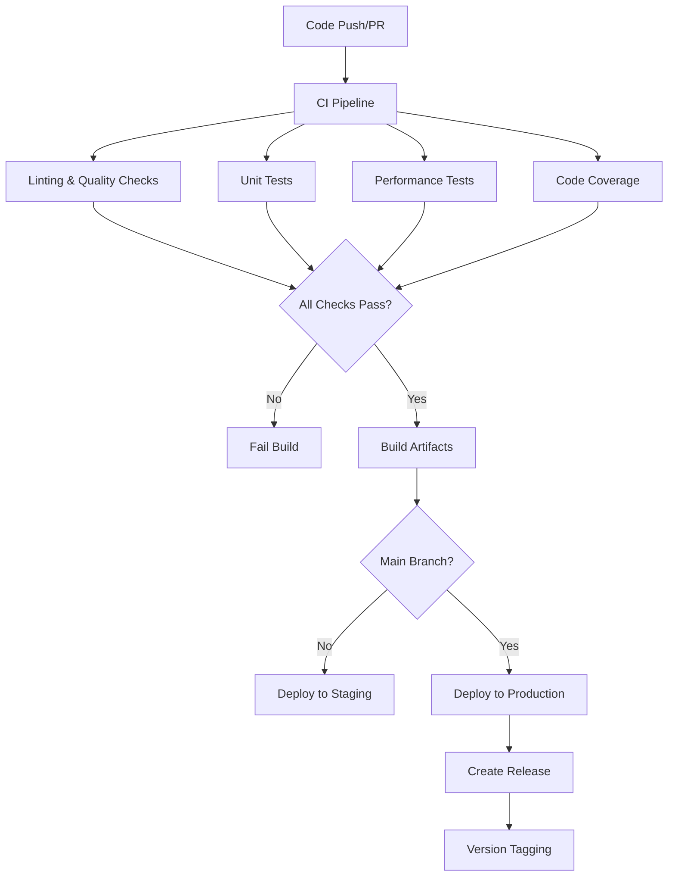

# CI/CD Pipeline Design

## Overview

This design implements a comprehensive CI/CD pipeline for LightBikes using GitHub Actions. The system provides automated testing, code quality checks, builds, deployments, and release management to ensure reliable software delivery while maintaining high code quality standards.

The pipeline follows a multi-stage approach with clear separation between continuous integration (CI) and continuous deployment (CD) concerns, supporting both pull request validation and automated production deployments.

## Architecture

### Pipeline Structure



### Workflow Organization

The CI/CD system consists of three main GitHub Actions workflows:

1. **CI Workflow** (`ci.yml`) - Runs on all pull requests and pushes
2. **CD Workflow** (`cd.yml`) - Runs on main branch merges
3. **Release Workflow** (`release.yml`) - Handles version tagging and releases

## Components and Interfaces

### 1. CI Pipeline Component

**Purpose**: Validates code quality and functionality on every change

**Key Features**:
- Multi-browser testing (Chrome, Firefox, Safari via Playwright)
- Parallel test execution for performance
- ESLint and Prettier integration
- Security vulnerability scanning
- Code coverage reporting with 95% threshold

**Interface**:
```yaml
# Triggered by: push, pull_request
# Outputs: test-results, coverage-report, build-artifacts
# Status: success/failure with detailed feedback
```

**Design Rationale**: Separating CI from CD allows for faster feedback on pull requests while maintaining deployment safety. Multi-browser testing ensures cross-platform compatibility critical for a browser-based game.

### 2. Code Quality Component

**Purpose**: Enforces consistent coding standards and identifies potential issues

**Key Features**:
- ESLint configuration aligned with project standards
- Prettier formatting validation
- JSDoc comment validation
- Dependency vulnerability scanning using npm audit
- Custom rules for game-specific patterns

**Configuration Files**:
- `.eslintrc.js` - ESLint rules and overrides
- `.prettierrc` - Code formatting standards
- `jest.config.js` - Test configuration with coverage thresholds

**Design Rationale**: Automated quality checks prevent technical debt accumulation and ensure consistent code style across contributors.

### 3. Testing Infrastructure

**Purpose**: Comprehensive test execution with detailed reporting

**Key Features**:
- Jest test runner with jsdom environment
- Parallel test execution across multiple Node.js versions
- Coverage reporting with line, branch, and function metrics
- Integration with Codecov for trend analysis
- PR comments with coverage summaries

**Test Matrix**:
```yaml
strategy:
  matrix:
    node-version: [16.x, 18.x, 20.x]
    browser: [chrome, firefox, safari]
```

**Design Rationale**: Multi-version testing ensures compatibility across different environments. The 95% coverage threshold maintains high code quality while allowing for reasonable exceptions.

### 4. Build System

**Purpose**: Creates optimized production artifacts

**Key Features**:
- Browserify bundling with optimization flags
- Asset minification and compression
- Cache-busting through content hashing
- Source map generation for debugging
- Artifact storage for manual deployment

**Build Process**:
1. Install dependencies with npm ci
2. Run Browserify with production optimizations
3. Generate minified bundle.js
4. Create deployment package with assets
5. Upload artifacts to GitHub Actions

**Design Rationale**: Optimized builds reduce load times and bandwidth usage. Artifact storage provides deployment flexibility and rollback capabilities.

### 5. Deployment System

**Purpose**: Automated deployment to staging and production environments

**Key Features**:
- GitHub Pages deployment for production
- Temporary staging URLs for feature branches
- Automatic cleanup of staging environments
- Rollback capabilities through GitHub Pages history
- Environment-specific configuration

**Deployment Targets**:
- **Production**: `https://username.github.io/lightbikes/`
- **Staging**: `https://username.github.io/lightbikes-staging-{pr-number}/`

**Design Rationale**: GitHub Pages provides reliable, free hosting suitable for static web applications. Staging deployments enable thorough testing before production release.

### 6. Release Management

**Purpose**: Automated version tagging and release creation

**Key Features**:
- Semantic versioning (major.minor.patch)
- Automated changelog generation from commit messages
- GitHub release creation with assets
- Version bumping in package.json
- Release notes from PR descriptions

**Versioning Strategy**:
- **Major**: Breaking changes or major feature additions
- **Minor**: New features, backward compatible
- **Patch**: Bug fixes and minor improvements

**Design Rationale**: Automated releases reduce manual effort and ensure consistent versioning. Semantic versioning helps users understand the impact of updates.

### 7. Performance Monitoring

**Purpose**: Tracks performance metrics and prevents regressions

**Key Features**:
- Bundle size monitoring with thresholds
- Load time measurement using Lighthouse
- Memory usage profiling
- FPS benchmarking for game performance
- Performance budget enforcement

**Metrics Tracked**:
- Bundle size (threshold: 500KB)
- First Contentful Paint (threshold: 2s)
- Time to Interactive (threshold: 3s)
- Game startup time (threshold: 1s)
- Average FPS during gameplay (minimum: 30fps)

**Design Rationale**: Performance monitoring prevents degradation over time and ensures optimal user experience across different devices.

## Data Models

### Pipeline Configuration

```javascript
// .github/workflows/ci.yml structure
{
  name: "CI Pipeline",
  triggers: ["push", "pull_request"],
  jobs: {
    test: {
      strategy: "matrix",
      steps: ["checkout", "setup", "lint", "test", "coverage"]
    },
    build: {
      needs: ["test"],
      steps: ["checkout", "setup", "build", "upload-artifacts"]
    }
  }
}
```

### Coverage Report Schema

```javascript
{
  coverage: {
    statements: { pct: 95.2, covered: 1234, total: 1296 },
    branches: { pct: 92.1, covered: 456, total: 495 },
    functions: { pct: 98.5, covered: 67, total: 68 },
    lines: { pct: 95.8, covered: 1189, total: 1241 }
  },
  files: [
    {
      path: "game.js",
      coverage: { /* file-specific metrics */ }
    }
  ]
}
```

### Deployment Manifest

```javascript
{
  version: "1.2.3",
  buildId: "abc123",
  timestamp: "2024-01-15T10:30:00Z",
  assets: [
    { file: "bundle.js", hash: "sha256-...", size: 245678 },
    { file: "index.html", hash: "sha256-...", size: 3456 }
  ],
  environment: "production",
  commitSha: "def456"
}
```

## Error Handling

### Build Failures

**Strategy**: Fail fast with clear error messages and actionable feedback

**Implementation**:
- Detailed error logs with context
- PR comments with failure summaries
- Slack/email notifications for main branch failures
- Automatic retry for transient failures (network issues)

### Test Failures

**Strategy**: Comprehensive reporting with debugging information

**Implementation**:
- Test result artifacts with detailed output
- Screenshot capture for browser test failures
- Coverage diff highlighting problematic areas
- Bisection suggestions for regression identification

### Deployment Failures

**Strategy**: Safe rollback with minimal downtime

**Implementation**:
- Health checks before marking deployment successful
- Automatic rollback on deployment failure
- Blue-green deployment strategy for zero-downtime updates
- Manual rollback triggers for emergency situations

### Performance Regressions

**Strategy**: Early detection with automated alerts

**Implementation**:
- Performance budget violations fail the build
- Trend analysis to identify gradual degradation
- Comparison with baseline measurements
- Detailed performance reports with recommendations

## Testing Strategy

### Unit Testing

**Scope**: Individual component functionality
**Tools**: Jest with jsdom environment
**Coverage Target**: 95% statement coverage
**Execution**: Parallel across multiple Node.js versions

### Integration Testing

**Scope**: Component interactions and game flow
**Tools**: Jest with full game simulation
**Focus Areas**: Game state management, AI behavior, collision detection
**Execution**: Sequential to avoid race conditions

### Browser Testing

**Scope**: Cross-browser compatibility
**Tools**: Playwright for automated browser testing
**Browsers**: Chrome, Firefox, Safari (latest versions)
**Test Types**: Rendering, input handling, performance

### Performance Testing

**Scope**: Load times, bundle size, runtime performance
**Tools**: Lighthouse CI, custom benchmarking scripts
**Metrics**: Bundle size, FPS, memory usage, startup time
**Thresholds**: Configurable limits with failure conditions

### Security Testing

**Scope**: Dependency vulnerabilities, code security
**Tools**: npm audit, GitHub security advisories
**Frequency**: Every build and weekly scheduled scans
**Response**: Automatic PR creation for security updates

## Implementation Phases

### Phase 1: Basic CI Pipeline
- Set up GitHub Actions workflows
- Implement linting and basic testing
- Configure code coverage reporting
- Establish build artifact generation

### Phase 2: Enhanced Testing
- Add multi-browser testing
- Implement performance monitoring
- Set up security scanning
- Configure parallel test execution

### Phase 3: Deployment Automation
- Implement GitHub Pages deployment
- Set up staging environment
- Configure automatic cleanup
- Add deployment health checks

### Phase 4: Release Management
- Implement semantic versioning
- Set up automated changelog generation
- Configure GitHub releases
- Add rollback capabilities

### Phase 5: Monitoring and Optimization
- Implement performance budgets
- Set up trend analysis
- Configure alerting and notifications
- Optimize pipeline performance

## Security Considerations

### Secrets Management
- GitHub repository secrets for sensitive data
- Environment-specific secret scoping
- Regular secret rotation procedures
- Audit logging for secret access

### Dependency Security
- Automated vulnerability scanning
- Dependency update automation
- Security advisory monitoring
- Supply chain attack prevention

### Deployment Security
- Secure deployment keys
- Environment isolation
- Access control for production deployments
- Audit trails for all deployments

This design provides a robust, scalable CI/CD pipeline that addresses all requirements while maintaining flexibility for future enhancements and ensuring high code quality standards throughout the development lifecycle.