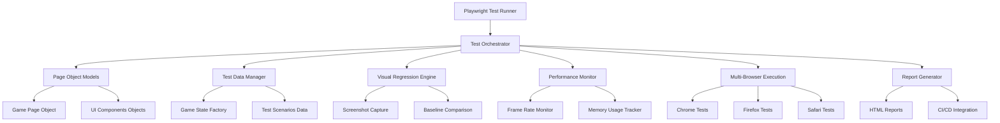

# E2E Testing Design Document

## Overview

This design implements comprehensive End-to-End testing for LightBikes using Playwright to ensure the game functions correctly from a user perspective across different browsers and devices. The system will validate complete user workflows, visual consistency, performance characteristics, and cross-browser compatibility through automated testing scenarios.

The E2E testing framework will integrate seamlessly with the existing development workflow, providing fast feedback during development while ensuring comprehensive validation of all game features and modes.

## Architecture

### Testing Framework Architecture



### Test Execution Flow

1. **Test Initialization**: Set up browser contexts and test data
2. **Page Object Creation**: Initialize page objects for game interaction
3. **Test Scenario Execution**: Run specific test workflows
4. **Assertion Validation**: Verify expected outcomes
5. **Visual Capture**: Take screenshots for regression testing
6. **Performance Measurement**: Collect metrics during test execution
7. **Report Generation**: Compile results and generate reports

## Components and Interfaces

### Core Testing Components

#### 1. Test Orchestrator
```javascript
class TestOrchestrator {
    constructor(config) {
        this.browsers = config.browsers;
        this.testSuites = config.testSuites;
        this.reportGenerator = new ReportGenerator();
    }
    
    async runTestSuite(suiteName, options = {}) {
        // Coordinate test execution across browsers
    }
    
    async setupTestEnvironment() {
        // Initialize browsers and test contexts
    }
    
    async teardownTestEnvironment() {
        // Clean up resources and generate reports
    }
}
```

#### 2. Game Page Object Model
```javascript
class GamePageObject {
    constructor(page) {
        this.page = page;
        this.gameCanvas = page.locator('canvas');
        this.restartButton = page.locator('#restartButton');
        this.scoreDisplay = page.locator('#score');
    }
    
    async startGame() {
        // Navigate to game and wait for initialization
    }
    
    async makeMove(direction) {
        // Simulate player input
    }
    
    async waitForGameState(state) {
        // Wait for specific game conditions
    }
    
    async captureGameScreenshot(name) {
        // Take screenshot for visual regression
    }
}
```

#### 3. Visual Regression Manager
```javascript
class VisualRegressionManager {
    constructor(baselinePath, outputPath) {
        this.baselinePath = baselinePath;
        this.outputPath = outputPath;
        this.diffThreshold = 0.2;
    }
    
    async captureBaseline(page, testName) {
        // Capture baseline screenshots
    }
    
    async compareScreenshot(page, testName) {
        // Compare current screenshot with baseline
    }
    
    async generateVisualReport() {
        // Create visual diff reports
    }
}
```

#### 4. Performance Monitor
```javascript
class PerformanceMonitor {
    constructor(page) {
        this.page = page;
        this.metrics = [];
    }
    
    async startMonitoring() {
        // Begin performance data collection
    }
    
    async measureFrameRate() {
        // Monitor FPS during gameplay
    }
    
    async measureMemoryUsage() {
        // Track memory consumption
    }
    
    async generatePerformanceReport() {
        // Compile performance metrics
    }
}
```

### Test Data Management

#### Test Scenario Factory
```javascript
class TestScenarioFactory {
    static createBasicGameplay() {
        return {
            playerMoves: ['ArrowUp', 'ArrowRight', 'ArrowDown'],
            expectedOutcome: 'collision',
            duration: 5000
        };
    }
    
    static createPowerUpScenario() {
        return {
            powerUpType: 'speed',
            activationTiming: 2000,
            expectedEffect: 'increased_speed'
        };
    }
    
    static createDifficultyTestScenario(level) {
        return {
            difficultyLevel: level,
            aiAggressiveness: this.getAISettings(level),
            expectedBehavior: this.getExpectedAI(level)
        };
    }
}
```

## Data Models

### Test Configuration Model
```javascript
const testConfig = {
    browsers: [
        { name: 'chromium', viewport: { width: 1920, height: 1080 } },
        { name: 'firefox', viewport: { width: 1920, height: 1080 } },
        { name: 'webkit', viewport: { width: 1920, height: 1080 } }
    ],
    mobileViewports: [
        { width: 375, height: 667 }, // iPhone SE
        { width: 414, height: 896 }, // iPhone 11
        { width: 360, height: 640 }  // Android
    ],
    testSuites: {
        smoke: ['basic-gameplay', 'game-initialization'],
        regression: ['all-game-modes', 'visual-regression', 'performance'],
        full: ['comprehensive-scenarios', 'cross-browser', 'mobile']
    },
    performance: {
        minFPS: 55,
        maxMemoryMB: 100,
        maxLoadTimeMS: 3000
    }
};
```

### Test Result Model
```javascript
class TestResult {
    constructor() {
        this.testName = '';
        this.browser = '';
        this.viewport = '';
        this.status = 'pending'; // pending, passed, failed, skipped
        this.duration = 0;
        this.screenshots = [];
        this.performanceMetrics = {};
        this.errorDetails = null;
        this.visualDiffs = [];
    }
}
```

## Error Handling

### Test Failure Recovery
- **Retry Logic**: Automatic retry for flaky tests (max 3 attempts)
- **Graceful Degradation**: Continue test suite execution even if individual tests fail
- **Error Categorization**: Classify failures as test issues vs. application bugs
- **Screenshot Capture**: Automatic screenshot on test failure for debugging

### Browser Compatibility Issues
- **Feature Detection**: Check for required browser features before test execution
- **Fallback Strategies**: Alternative test approaches for unsupported features
- **Browser-Specific Handling**: Custom logic for browser quirks and differences

### Performance Test Stability
- **Warm-up Periods**: Allow browser to stabilize before performance measurements
- **Multiple Measurements**: Take average of multiple performance samples
- **Environment Validation**: Verify test environment meets performance testing requirements

## Testing Strategy

### Test Categories and Coverage

#### 1. Core Functionality Tests
- **Game Initialization**: Verify game loads correctly and canvas renders
- **Player Controls**: Test all movement directions and input responsiveness
- **AI Behavior**: Validate AI decision-making and pathfinding
- **Collision Detection**: Test boundary, trail, and opponent collisions
- **Game State Management**: Verify pause, restart, and game over scenarios

#### 2. Game Mode Tests
- **Classic Mode**: Standard gameplay with basic rules
- **Time Trial Mode**: Time-based challenges and scoring
- **Arena Shrink Mode**: Dynamic arena size changes
- **Power-Up Integration**: Power-up collection and effects
- **Difficulty Levels**: AI behavior variations across difficulty settings

#### 3. Visual Regression Tests
- **UI Elements**: Menu screens, buttons, score displays
- **Game Rendering**: Arena, trails, bikes, and effects
- **Theme Variations**: Different color schemes and visual themes
- **Responsive Design**: Layout adaptation across screen sizes
- **Animation Consistency**: Smooth transitions and effects

#### 4. Performance Tests
- **Frame Rate Monitoring**: Maintain 60 FPS during gameplay
- **Memory Usage**: Track memory consumption and detect leaks
- **Loading Performance**: Game initialization and asset loading times
- **Stress Testing**: Performance under extended gameplay sessions

#### 5. Cross-Browser Tests
- **Feature Compatibility**: WebGL, touch events, keyboard input
- **Rendering Consistency**: Visual appearance across browsers
- **Performance Variations**: Browser-specific performance characteristics
- **Mobile Browser Testing**: Touch controls and mobile-specific features

### Test Execution Strategy

#### Development Workflow Integration
- **Pull Request Tests**: Run smoke tests on PR creation
- **Commit Validation**: Quick regression tests on main branch commits
- **Nightly Full Suite**: Comprehensive testing including visual regression
- **Release Validation**: Complete test suite before version releases

#### Parallel Execution
- **Browser Parallelization**: Run tests simultaneously across different browsers
- **Test Suite Splitting**: Divide tests into independent groups for faster execution
- **Resource Management**: Optimize browser instance usage and cleanup

#### Test Data Management
- **Deterministic Scenarios**: Consistent test data for reliable results
- **Game State Snapshots**: Pre-configured game states for specific test scenarios
- **Random Seed Control**: Reproducible AI behavior for consistent testing

## Implementation Approach

### Phase 1: Foundation Setup
1. **Playwright Configuration**: Set up test framework and browser configurations
2. **Basic Page Objects**: Create core page object models for game interaction
3. **Simple Test Scenarios**: Implement basic gameplay and UI tests
4. **CI/CD Integration**: Configure test execution in GitHub Actions

### Phase 2: Comprehensive Testing
1. **Advanced Test Scenarios**: Implement complex gameplay and feature tests
2. **Visual Regression System**: Set up screenshot comparison and baseline management
3. **Performance Monitoring**: Integrate performance measurement and reporting
4. **Cross-Browser Expansion**: Add Firefox and Safari test execution

### Phase 3: Optimization and Reporting
1. **Test Reliability**: Improve test stability and reduce flakiness
2. **Advanced Reporting**: Enhanced test reports with visual diffs and metrics
3. **Mobile Testing**: Add mobile browser and touch control testing
4. **Maintenance Tools**: Test baseline management and debugging utilities

### Design Decisions and Rationales

#### Playwright Framework Selection
- **Rationale**: Modern, fast, and reliable browser automation with excellent debugging capabilities
- **Benefits**: Built-in visual testing, mobile emulation, and comprehensive browser support
- **Trade-offs**: Learning curve for team, but superior to Selenium for modern web applications

#### Page Object Model Pattern
- **Rationale**: Maintainable test code with clear separation of concerns
- **Benefits**: Reusable page interactions, easier test maintenance, better readability
- **Implementation**: Separate page objects for different game screens and components

#### Visual Regression Integration
- **Rationale**: Critical for catching unintended visual changes in a graphics-heavy game
- **Benefits**: Automated detection of visual bugs, baseline management, diff reporting
- **Approach**: Screenshot comparison with configurable diff thresholds

#### Performance Testing Integration
- **Rationale**: Game performance directly impacts user experience
- **Benefits**: Continuous performance monitoring, regression detection, optimization guidance
- **Metrics**: Frame rate, memory usage, loading times, and resource utilization

#### Multi-Browser Strategy
- **Rationale**: Ensure consistent experience across different browsers and devices
- **Coverage**: Chrome (primary), Firefox, Safari, and mobile browsers
- **Execution**: Parallel test execution for faster feedback cycles